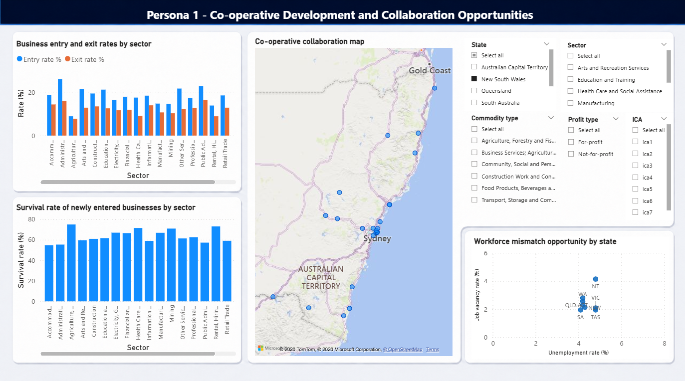
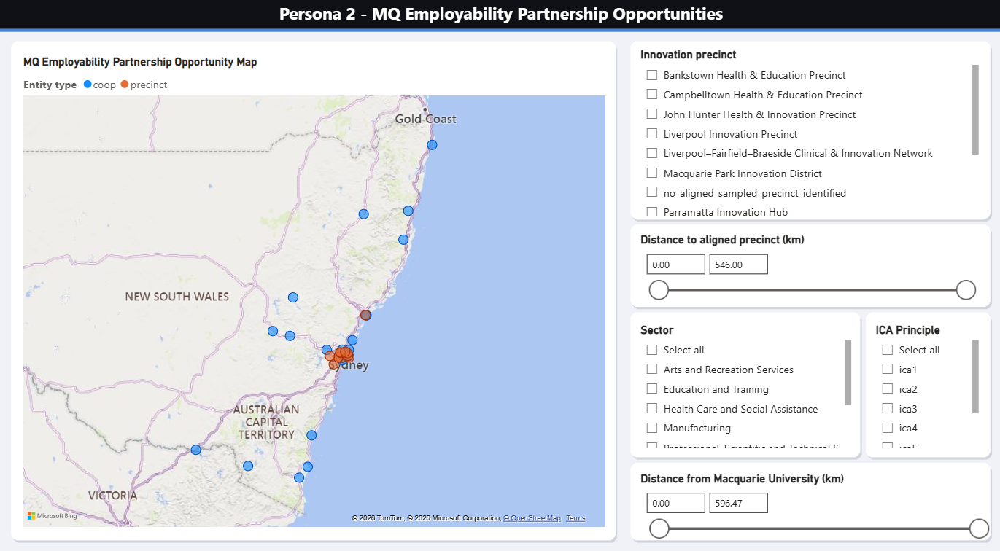
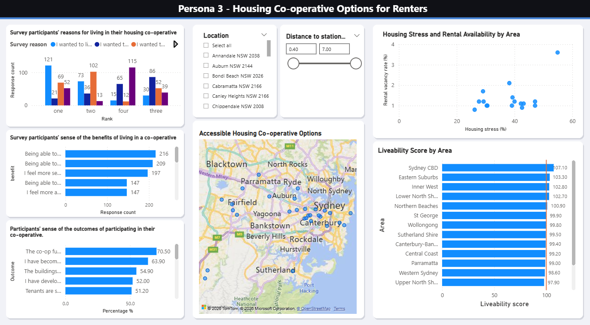

# Extending the Co-op Map through Visual Data Exploration

## Project Overview

This client-based Business Analytics project was developed for Mercury Co-operative Limited to explore how its existing Co-op Map could be extended into an interactive visual data exploration environment.

The solution was designed around three stakeholder personas, enabling users to explore cooperative-sector data according to different decision-making needs rather than presenting fixed conclusions.

## Client

Mercury Co-operative Limited

## Tools

- Microsoft Power BI
- Microsoft Excel

## Project Approach

- Designed three stakeholder personas around different decision-making needs.
- Developed non-trivial data exploration questions for each stakeholder group.
- Collected, cleaned, validated and integrated data from multiple sources.
- Developed an interactive Power BI visual data exploration environment.
- Used maps, charts, filters and tooltips to support user-led exploration.
- Considered data quality, data ethics, visual ethics and unintended data harm.
- Developed recommendations for future use and further development of the solution.

## Stakeholder Applications

### 1. Co-operative Development and Collaboration

Designed for a Mercury board director to explore cooperative development opportunities, collaboration possibilities and workforce-related patterns.

### 2. Employability Partnership Exploration

Designed for an employability stakeholder to explore potential cooperative partnerships based on sector alignment, innovation precinct proximity, values and accessibility.

### 3. Housing Co-operative Exploration

Designed for a young renter experiencing housing stress to explore housing cooperative benefits, existing options and potential areas for future cooperative development.

## Data Quality and Responsible Analytics

The project considered syntactic, semantic and pragmatic data quality, together with data ethics, visual ethics and unintended data harm.

Metadata, assumptions and limitations were incorporated to support responsible interpretation of the visualisations.

## Project Report

[Read the full project report](./Mercury_Cooperative_Visual_Data_Exploration_Report.pdf)

## Data Availability

This project combined a client-provided subset of Australian cooperative records with additional publicly available and manually collected datasets.

The underlying client-provided dataset, complete project dataset and executable Power BI file are not included in this public repository.

## Project Context

Group project completed at Macquarie University in 2026 for Mercury Co-operative Limited.
